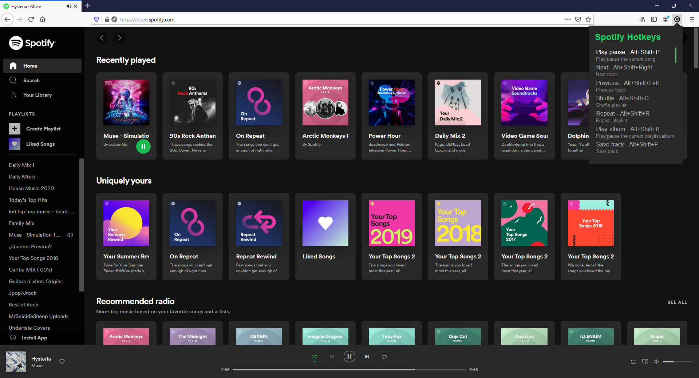

# Spotify Web Player Hotkeys Firefox Extension

This extension adds keyboard shortcuts to Firefox to play, pause, next and previous tracks in [Spotify Web Player](https://open.spotify.com).

## Usage

Default Keyboard shortcuts are:

- Play/Pause : Alt+Shift+P
- Next       : Alt+Shift+Right Arrow
- Previous   : Alt+Shift+Left Arrow
- Shuffle    : Alt+Shift+D
- Repeat     : Alt+Shift+R
- Play-Album : Alt+Shift+B
- Save Track : Alt+Shift+F

The `Play Album or PlayGreen` shortcut play also play/pause the songs like the `Play/Pause` shortcut but is useful when Spotify Web Player gets stuck with an add.

Instead of using the keybord it's possible to click on the icon of the toolbar which will show the keybindings. Thanks to [Piatra](https://github.com/piatra)

## Installation

You can find the signed Firefox Extension at https://addons.mozilla.org/en-US/firefox/addon/spotify-hotkeys/

## Option page

The option page of the extension allows the user to customize the shortcuts and some settings. See the [wiki](https://github.com/TsunDoge/spotify-hotkeys-firefox/wiki/How-to-use-Spotify-Shortcuts) for more information.

### Settings

The following options can be enabled/disabled in the option page.

- Open Spotify with shortcuts: When the user hit a shortcut open spotify if it is not opened yet.

### Custom Shorcuts

It is possible to change the default shortcuts to custom ones. See the [wiki](https://github.com/TsunDoge/spotify-hotkeys-firefox/wiki/How-to-use-Spotify-Shortcuts#configure-shortcuts) for more information.

**NOTE:** On Firefox >= 66.0-build3 or Firefox >= 67.0a1 a new interface has been implemented to change the default shortcuts. See the [issue](https://bugzilla.mozilla.org/show_bug.cgi?id=1303384)
