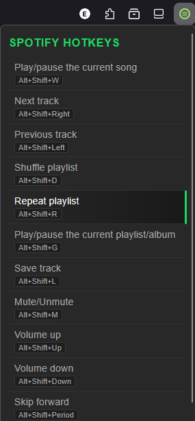
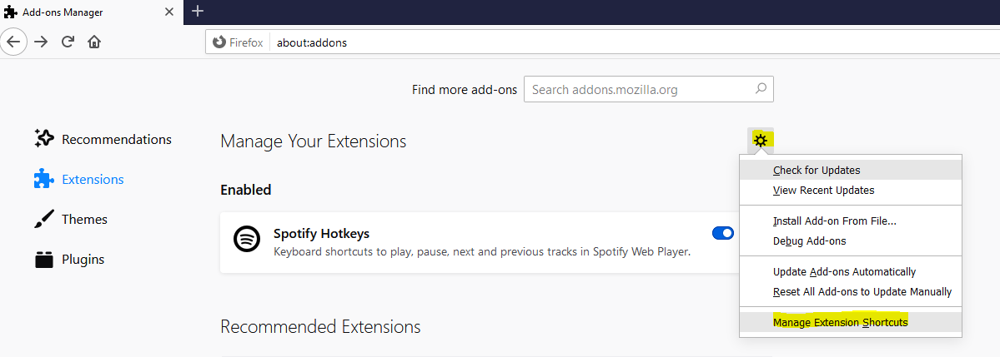
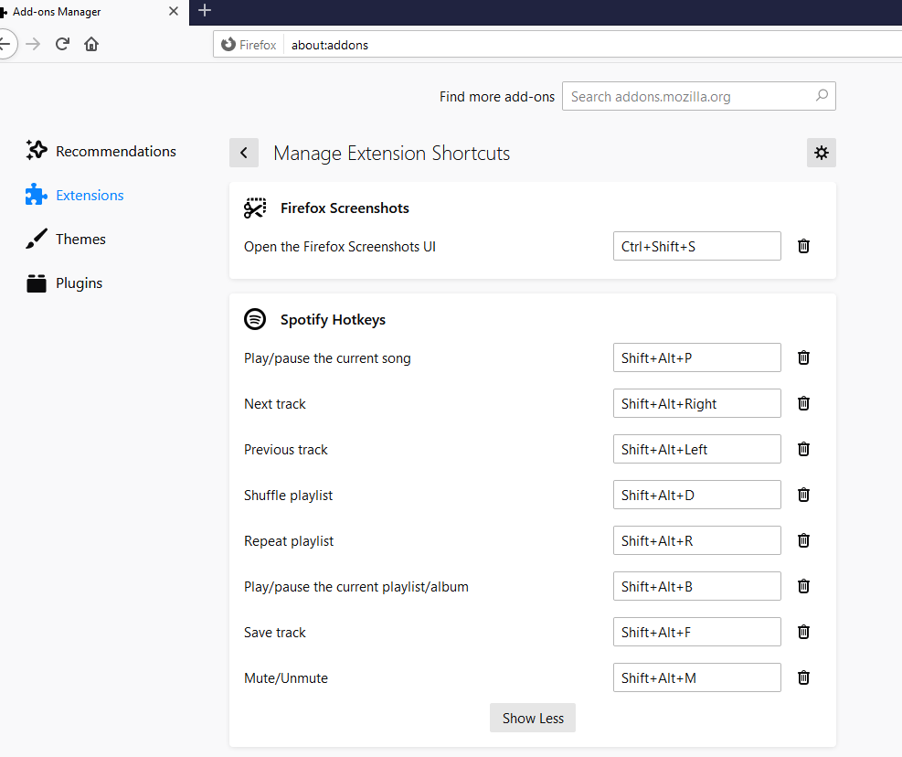
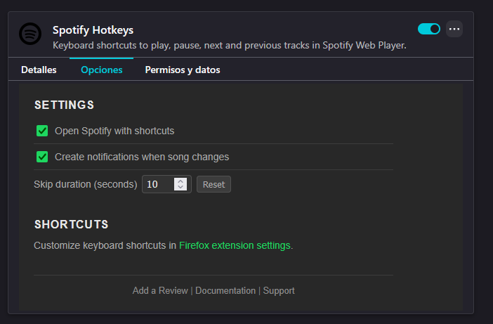

# Spotify Web Player Hotkeys Firefox Extension

This extension adds global keyboard shortcuts to Firefox to control [Spotify Web Player](https://open.spotify.com) — play, pause, skip, volume, shuffle, repeat, and more.



## Usage

Default Keyboard shortcuts are:
```
- Play/Pause  : Alt + Shift + W
- Next        : Alt + Shift + Right Arrow
- Previous    : Alt + Shift + Left Arrow
- Shuffle     : Alt + Shift + D
- Repeat      : Alt + Shift + R
- Play-Album  : Alt + Shift + G
- Save Track  : Alt + Shift + L
- Mute/Unmute : Alt + Shift + M
- Volume Up   : Alt + Shift + Up Arrow
- Volume Down : Alt + Shift + Down Arrow
- Skip Forward: Alt + Shift + Period
- Skip Back   : Alt + Shift + Comma
```

The `Play Album` shortcut can also play/pause songs like the `Play/Pause` shortcut but is useful when Spotify Web Player gets stuck with an ad.

Instead of using the keyboard, it's possible to click on the toolbar icon which will show the keybindings.

## Installation

You can find the signed Firefox Extension at https://addons.mozilla.org/en-US/firefox/addon/spotify-hotkeys/

## [Customizing the shortcuts](https://support.mozilla.org/en-US/kb/manage-extension-shortcuts-firefox)

You can change your extensions' keyboard shortcuts on the add-ons page.

1. Click the menu button, click `Add-ons` and select `Extensions`.
2. Click the Tools for all add-ons cogwheel.
3. Click `Manage Extension Shortcuts` in the menu.
4. You will see the shortcut options (if available) for your installed add-ons.




## Options page

The options page allows the user to configure the following settings:

- **Open Spotify with shortcuts**: When a shortcut is pressed, open Spotify if it is not already open.
- **Create notifications when song changes**: Show a desktop notification with track info on song change.
- **Skip duration**: How many seconds to skip forward or back (1–60 seconds, default 10).


